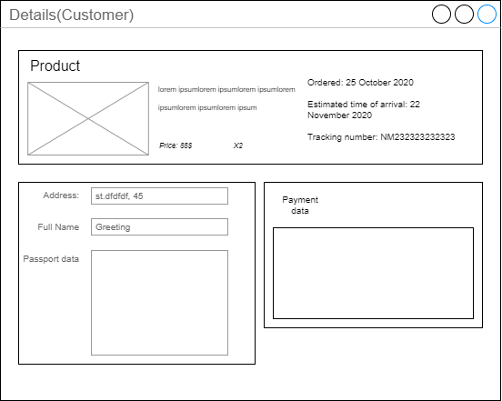

## Проектирование интерфейсов

### Список интерфейсов

В системе Личная библиотека для незарегистрированных пользователей будут доступны следующие страницы:
- Главная страница системы;
- Избранное;
- Подробно о товаре;
- Авторизация;
- Регистрация.

Действующее лицо Покупателя будет иметь доступ к страницам:
- Главная страница покупателя;
- Корзина заказов;
- Оформление заказа;
- Избранное;
- Детали заказа;
- История заказов.

Самый большой список страниц будет доступен действующему лицу Магазин:
- Главная страница для магазина;
- Список товаров в магазине;
- Добавление товаров;
- Редактировнаие товаров;
- Удаление товаров;
- Статистика;
- Детали отправленных заказов;
- Список заказов.

### Эскизы интерфейсов

**Для Гостя**

.png)

**Для Покупателя**

**Для Продавца**

### Диаграммы интерфейсов

**Для Гостя**

**Для Покупателя**

**Для Магазина**

