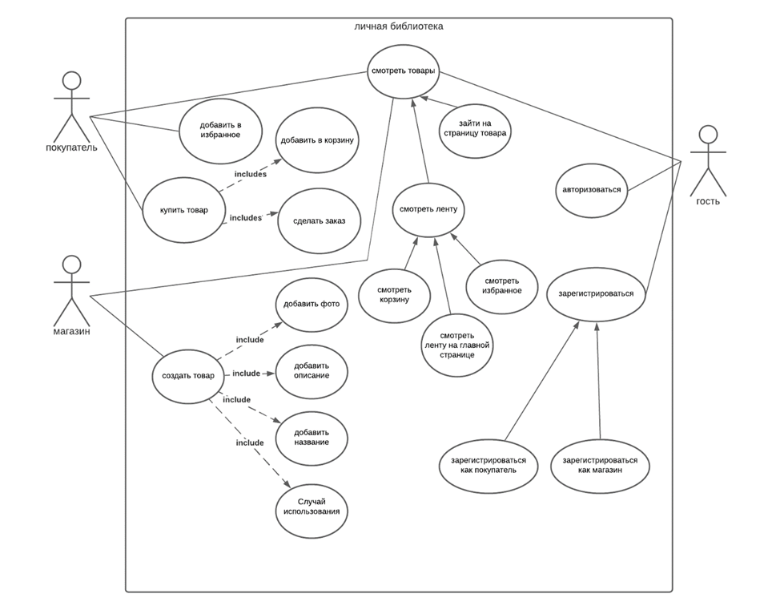

#Список акторов:
1. незарегистрированный пользователь
2. зарегистрированный пользователь
3. магазин (организация)
##Диаграмма прецедентов использования

##Прецеденты использования:

|Прецедент использования | Регистрация пользователя|
|------------------------|-------------------------|
Краткое описание | Гость создаёт новую учётную запись |
Действующие лица | гость |
Предусловия | Нет |
Основной поток | Гость вводит почту и пароль и жмёт кнопку зарегистрироваться |
Альтернативные потоки | Гость не вводит email или пароль, вводит их в неправильном формате, email уже есть в системе |
Постусловия | В базе данных появляется новый пользователь с почтой паролем и id |

|Прецедент использования | Регистрация магазина |
|------------------------|-------------------------|
Краткое описание | Гость создаёт новый магазин |
Действующие лица | Гость |
Предусловия | Нет |
Основной поток | Гость вводит email и пароль, карту и жмёт кнопку создать магазин |
Альтернативные потоки | Гость не вводит email или пароль или вводит их в неправильном формате |
Постусловия | В базе данных появляется новый магазин с почтой паролем и id |

| Прецедент использования | Просмотр ленты |
|------------------------|-------------------------|
| Краткое описание | Просмотр ленты |
| Действующие лица |Гость, пользователь, магазин |
| Предусловия | В ленте есть товары |
| Основной поток | Гость заходит на главную, ему показывается лента |
| Альтернативные потоки | В ленте нет товаров, пользователю пишут “здесь пока ничего нет” |
| Постусловия |Нет |

| Прецедент использования | Заход на страницу товара |
|------------------------|-------------------------|
| Краткое описание | Пользователь из ленты заходит на страницу товара |
| Действующие лица | Гость, пользователь, магазин |
| Предусловия |Пользователь находится в ленте |
| Основной поток | Пользователь нажимает на товар в ленте |
| Альтернативные потоки | Нет |
| Постусловия | Нет |

| Прецедент использования | Добавление в избранное |
|------------------------|-------------------------|
| Краткое описание | Пользователь добавляет товар в избранное |
| Действующие лица | Пользователь |
| Предусловия | Этого товара нет в избранном пользователя |
| Основной поток | Пользователь жмёт на кнопку “добавить в избранное”, кнопка превращается в “в избранном” |
| Альтернативные потоки | Пользователь добавляет в избранное товар, который уже есть в избранном, этот товар исчезает из избранного |
| Постусловия | В базе данных в таблице пользователь ячейке избранное добавляется если его там не было или исчезает если он там был ID этого товара |

| Прецедент использования | Добавление в корзину |
|------------------------|-------------------------|
| Краткое описание | Пользователь добавляет товар в корзину |
| Действующие лица | Пользователь |
|Предусловия | Товара нет в корзине |
| Основной поток | Пользователь жмёт на кнопку “добавить в корзину”, кнопка превращается в “в корзине” |
| Альтернативные потоки | Пользователь добавляет в корзину товар, который уже есть в корзине, этот товар исчезает из корзины |
| Постусловия | В базе данных в таблице пользователь ячейке корзина добавляется если его там не было или исчезает если он там был ID этого товара |

| Прецедент использования | Оформление заказа |
|------------------------|-------------------------|
| Краткое описание | Пользователь заказывает оплачивает все товары в корзине, и они доставляются к нему |
| Действующие лица | Пользователь |
| Предусловия | В корзине есть товары |
| Основной поток | Пользователь жмёт на кнопку “оформить заказ”, и попадает на страницу с настройками заказа, вводит карту, вводит адрес (или не вводит если он их уже указывал в прошлый раз и не собирается менять), жмёт на кнопку “оплатить”, оплата проходит успешно, пользователю пишут, что ваш заказ доставляется |
| Альтернативные потоки | Пользователь ввёл что-то неверно, оплата не прошла, пользователь не ввёл что-то и нажал кнопку “оплатить”, тогда пользователю показывается что он ввёл неверно, пользователь не нажимает на кнопку, тогда ничего не происходит |
| Постусловия |При основном потоке: в базе данных сохраняется адрес пользователя, его карта, ID товаров переходят из корзины в заказ, и в заказ добавляется ID пользователя, деньги переводятся магазину, товар доставляется. При альтернативном потоке: ничего не меняется |

| Прецедент использования | Создание товара |
|------------------------|-------------------------|
| Краткое описание | Магазин добавляет товар |
| Действующие лица | Магазин |
| Предусловия | Нет |
Основной поток | Пользователь жмёт на кнопку создать товар, попадает на страницу создания товара, вводит название товара, описание товара, фотографии товара, жмёт кнопку “создать товар” |
| Альтернативные потоки | Что-то из введённого в неправильном формате, например слишком длинное название и описание, тогда клиент получает сообщение что не так |
| Постусловия | При основном потоке: в базе данных в таблице магазина добавляется id товара. В таблице товаров создается новый товар. При альтернативном потоке: ничего не меняется |